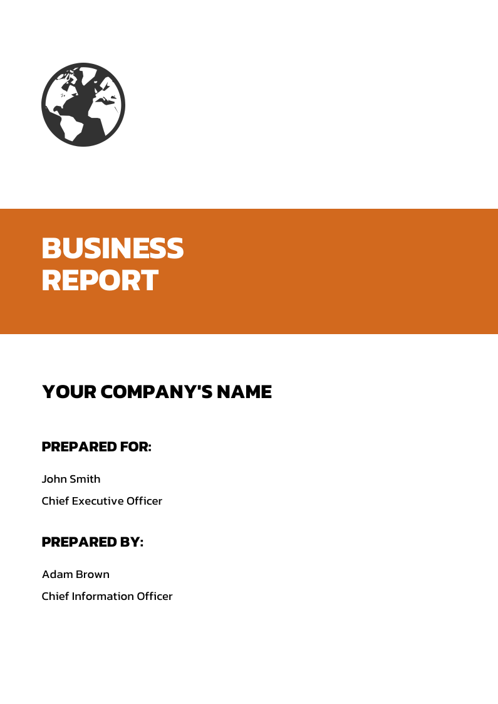
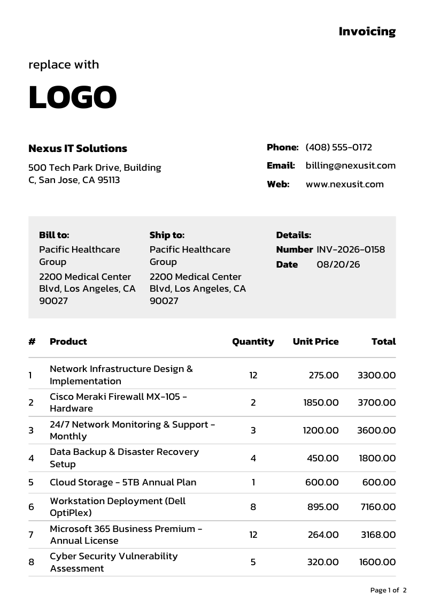
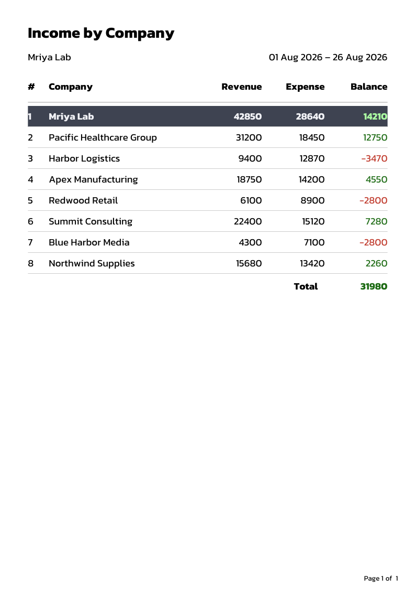
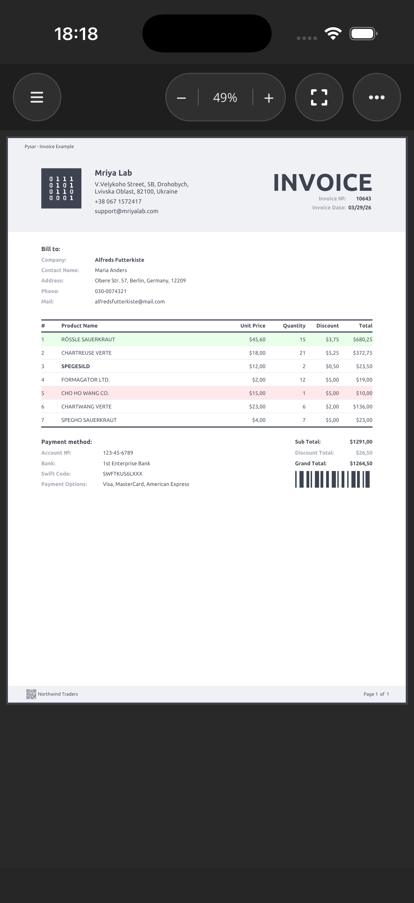

# Pysar Samples

Runnable samples for [Pysar](https://www.nuget.org/packages/Pysar) — a .NET reporting engine that
renders bands, layout panels and data bindings to Skia, and from there to a PDF or to an on-screen
viewer.

Every sample in this repository was built and executed to produce the screenshots below.

| Sample | What it shows | Runs on |
| --- | --- | --- |
| [Pysar.Console.Sample](src/Pysar.Console.Sample) | The report model itself: 6 reports, each written three ways (C# objects, fluent API, XAML), exported to PDF | any .NET 10 host |
| [Pysar.Sample.Shared](src/Pysar.Sample.Shared) | The shared report library the UI samples all consume | class library |
| [Pysar.Blazor.Wasm.Sample](src/Pysar.Blazor.Wasm.Sample) | `ReportView` in the browser via WebAssembly | any browser |
| [Pysar.Maui.Sample](src/Pysar.Maui.Sample) | `ReportView` on phone and tablet, plus print and PDF export | iOS, Android, Mac Catalyst |
| [Pysar.Avalonia.Sample](src/Pysar.Avalonia.Sample) | `ReportView` on the Avalonia desktop | Windows, macOS, Linux |
| [Pysar.Wpf.Sample](src/Pysar.Wpf.Sample) | `ReportView` on WPF | Windows |

## Quick start

```bash
dotnet build Pysar.Samples.sln
```

```bash
dotnet run --project src/Pysar.Console.Sample
```

The console sample prints a menu, and each choice writes a PDF to your desktop. That is the fastest
way to see the engine work without any UI framework in the way.

## The three principles behind every sample

### 1. A report is a stack of bands

A `Report` owns a `PageFormat` and a list of bands. Bands decide *when* content repeats: a
`PageHeaderBand` on every page, a `ReportHeaderBand` once at the start, a `DetailBand` once per row
of its data source, a `PageFooterBand` at the bottom of every page. Inside a band you lay elements
out with the panels you already know — `Grid`, `StackPanel`, `Frame` — and pagination is the
engine's problem, not yours.

```xml
<Report xmlns="https://mriyalab.com/pysar">
    <PageFormat Orientation="Portrait" Size="A4" />

    <ReportHeaderBand Height="Auto">
        <Text Content="Income by Company" FontSize="22" FontStyle="Bold" />
    </ReportHeaderBand>

    <DetailBand DataSource="{Binding Items}">
        <Grid ColumnDefinitions="30, *, 90">
            <Text Grid.Column="0" Content="{Binding Index}" />
            <Text Grid.Column="1" Content="{Binding Name}" />
            <Text Grid.Column="2" Content="{Binding Balance}" HorizontalAlignment="End" />
        </Grid>
    </DetailBand>
</Report>
```

### 2. The same report, three ways to author it

Pysar deliberately offers three authoring styles that produce an identical document. Pick whichever
fits the code around it — the console sample ships all three for every report so you can diff them
side by side.

<table>
<tr><th>Object initializers</th><th>Fluent API</th><th>XAML (<code>.rxaml</code>)</th></tr>
<tr valign="top"><td>

```csharp
var report = new Report();
report.PageFormat = new PageFormat
{
    Margin = new Thickness(50, 0),
    Size = PageSize.A4
};

var band = new PageHeaderBand();
band.AddElement(new Text
{
    Content = "BUSINESS REPORT",
    Font = new Font("Kanit", 38,
        Colors.White, FontStyle.Bold)
});

report.Bands.Add(band);
return report.Build();
```

</td><td>

```csharp
return ReportBuilder.Create("Business Report")
    .WithPageFormat(new PageFormat
    {
        Margin = new Thickness(50, 0),
        Size = PageSize.A4
    })
    .WithPageHeader(header => header
        .AddElement(new Text
            { Content = "BUSINESS REPORT" }
            .WithFont("Kanit", 38f,
                Colors.White, FontStyle.Bold)))
    .Build();
```

</td><td>

```xml
<Report x:Class="Sample.BusinessReportXaml"
        xmlns="https://mriyalab.com/pysar">
    <PageFormat Margin="50,0" Size="A4" />

    <PageHeaderBand>
        <Text Content="BUSINESS REPORT"
              FontColor="White"
              FontFamily="Kanit"
              FontSize="38"
              FontStyle="Bold" />
    </PageHeaderBand>
</Report>
```

</td></tr>
</table>

`.rxaml` files are compiled by a source generator into a `partial class`, exactly like WPF or MAUI
XAML, so `InitializeComponent()` in the code-behind is all the plumbing there is. XAML can also be
loaded and parsed at runtime with `ReportXaml.Load(...)`, which is what the console sample's last
menu entry demonstrates.

### 3. Build the report once, render it anywhere

`Report.Build()` produces a device-independent document. What you do with it afterwards is the only
thing that differs between the samples:

```csharp
// Console: straight to a PDF file.
var renderer = new SkiaReportRenderer();
await renderer.SavePdfAsync(report, path);
```

```xml
<!-- Avalonia, WPF, MAUI: hand it to the viewer control. -->
<pysar:ReportView Report="{Binding Report}"
                  CurrentPage="{Binding CurrentPage}"
                  Zoom="{Binding Zoom}"
                  ZoomMode="{Binding ZoomMode}" />
```

Every host needs two registrations before the first render — the fonts the reports use, and a
drawer for any custom element. In this repository both live in a single `ReportBootstrap` class
that every sample calls:

```csharp
public static void RegisterFonts(IFontCollection fonts)
{
    fonts.AddFont("Fonts/Ubuntu-Bold.ttf", "Ubuntu", FontStyle.Bold);
    fonts.AddFont("Fonts/Ubuntu-Regular.ttf", "Ubuntu");
    // ...
}

public static void RegisterDrawers(SkiaReportRenderer renderer)
    => renderer.WithDrawer<QRCode>(new QRCodeDrawer());
```

```csharp
// MAUI
builder.UseMauiApp<App>()
    .UsePysar(pysar => pysar
        .RegisterFonts(ReportBootstrap.RegisterFonts)
        .AddDrawer<QRCode>(new QRCodeDrawer()));

// Avalonia
AppBuilder.Configure<App>()
    .UsePysar(pysar => pysar
        .RegisterFonts(ReportBootstrap.RegisterFonts)
        .AddDrawer<QRCode>(new QRCodeDrawer()));

// Blazor WebAssembly
builder.Services.AddPysar(ReportBootstrap.RegisterDrawers);
```

## What the samples look like

Console sample — PDF output:

| Bands and layout | Data binding | Triggers |
| --- | --- | --- |
|  |  |  |

Blazor WebAssembly — the same reports in `ReportView`:


MAUI on an iPhone simulator:



## Repository layout

```
src/
  Pysar.Console.Sample/    reports written three ways + PDF export
  Pysar.Sample.Shared/    shared report library (Invoice, Annual, Revenue by customer)
  Pysar.Blazor.Wasm.Sample/
  Pysar.Maui.Sample/
  Pysar.Avalonia.Sample/
  Pysar.Wpf.Sample/
docs/screenshots/          the images in these READMEs
tools/                     helper scripts (icon generation, screenshot capture)
```

Package versions are managed centrally in [Directory.Packages.props](Directory.Packages.props);
bumping the `Pysar` version there updates every sample at once.
