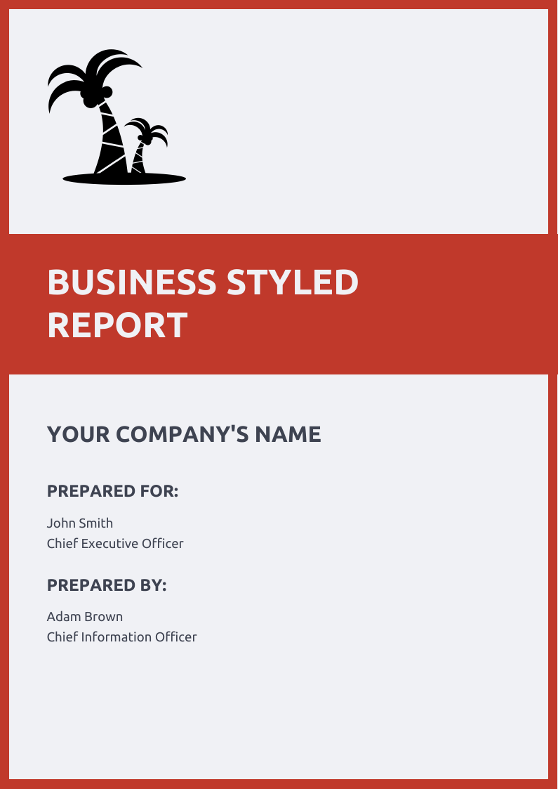
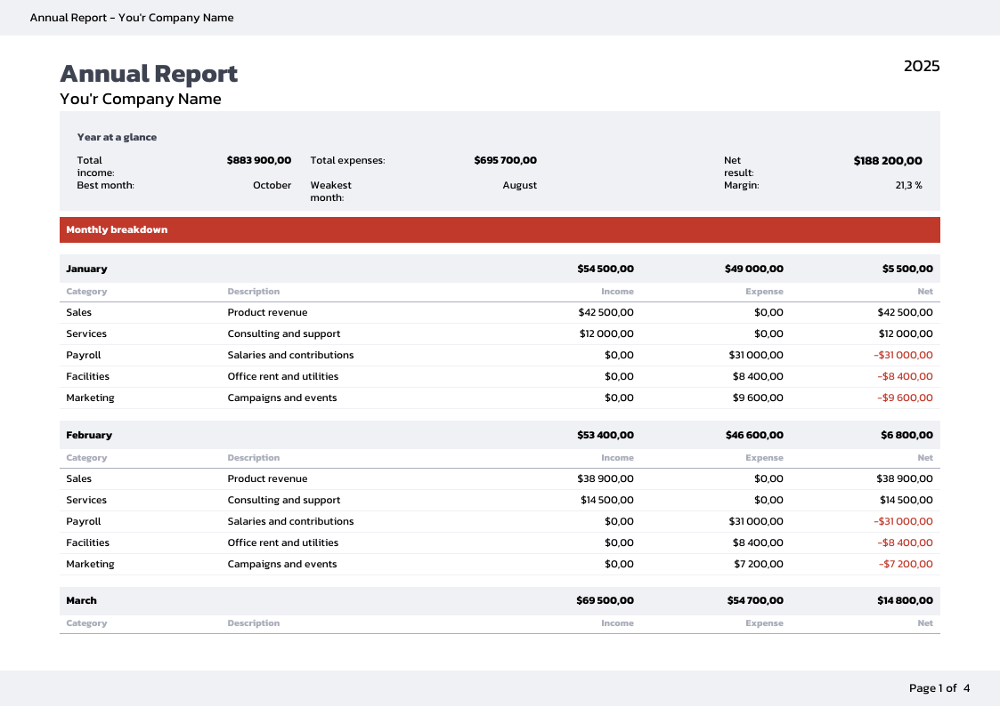
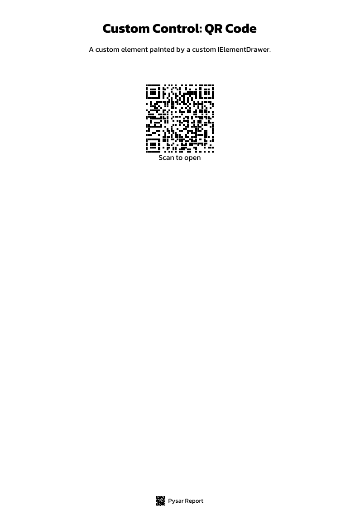

# Pysar.Console.Sample

The engine with no UI framework around it. Six reports, each authored three separate ways — C#
object initializers, the fluent `ReportBuilder`, and XAML — plus one report parsed from a XAML
string at runtime. Every menu entry exports a PDF to your desktop.

```bash
dotnet run --project src/Pysar.Console.Sample
```

```
Select a report to export:
  1. Business Report
  2. Business Report (Fluent API)
  3. Business Report (XAML)
  ...
 19. Runtime XAML load
  q. Quit
> 1
Exported Business Report -> /Users/you/Desktop/businessReport.pdf
```

The three variants of a report render byte-for-byte the same document, so the screenshots below show
one variant each.

## Bootstrapping

Nothing renders until a platform handler, the fonts and any custom drawers are registered. This
sample keeps that in one class, which `Program` and the design-time `.rxaml` preview host both call:

```csharp
public sealed class ReportBootstrap : IReportBootstrap
{
    public static void Initialize(SkiaReportRenderer renderer)
    {
        ReportPlatformHandler.Create(new FileSystemPlatformHandler());

        var fonts = ReportPlatformHandler.FontCollection;
        fonts.AddFont("Fonts/Kanit-Bold.ttf", "Kanit", FontStyle.Bold);
        fonts.AddFont("Fonts/Kanit-Regular.ttf", "Kanit");
        fonts.AddFont("Fonts/LibreBarcode128-Regular.ttf", "LibreBarcode128");

        renderer.WithDrawer<QRCode>(new QRCodeDrawer());
    }
}
```

`FileSystemPlatformHandler` is what turns `Images/world.svg` into bytes. Swap it and the same reports
read their assets from an app package instead — that is exactly what the MAUI and Blazor samples do.

Export is one call:

```csharp
var renderer = new SkiaReportRenderer();
await renderer.SavePdfAsync(report, path);
```

## `Reports/Base` — bands, panels, page format


A single `PageHeaderBand` holding a three-row `Grid`: logo, a coloured `Frame` that bleeds past the
page margin via a negative `Margin`, and a `StackPanel` of labels.

```csharp
var grid = new Grid
{
    Size = new Size(SizeLength.Fill, SizeLength.Fill),
    IsClippedToBounds = false,
    RowDefinitions =
    [
        new RowDefinition(GridLength.Fixed(250)),
        new RowDefinition(GridLength.Fixed(150)),
        new RowDefinition(GridLength.Star())
    ]
};

var frame = new Frame
{
    BackgroundColor = Colors.Chocolate,
    Margin = new Thickness(-50, 0),   // bleeds into the page margin
    IsClippedToBounds = false,
    Size = new Size(SizeLength.Fill, SizeLength.Fill)
};
```

`IsClippedToBounds = false` is the part worth remembering: without it the negative margin would be
clipped away and the colour band would stop at the text column.

Same thing in `.rxaml`, where `RowDefinitions` takes the compact grid syntax:

```xml
<PageHeaderBand IsClippedToBounds="False">
    <Grid Width="Fill" Height="Fill"
          IsClippedToBounds="False"
          RowDefinitions="250, 150, *">

        <Image Grid.Row="0" Width="100" Height="100">
            <Image.Source>
                <FileImageSource FilePath="Images/world.svg" />
            </Image.Source>
        </Image>

        <Frame Grid.Row="1" Margin="-50,0" BackgroundColor="Chocolate" IsClippedToBounds="False">
            <Text Content="BUSINESS REPORT" FontFamily="Kanit" FontSize="38"
                  FontColor="White" FontStyle="Bold" Position="50,0" />
        </Frame>
    </Grid>
</PageHeaderBand>
```

## `Reports/Data` — data binding and pagination


A `DetailBand` bound to a collection repeats its content once per item, and `DetailHeader` /
`DetailFooter` bracket the repetition. Page breaks are decided by the engine — this invoice spills
onto a second page on its own, and the `PageFooterBand` renumbers itself.

## `Reports/Styles` — resource dictionaries



Colours and styles live in `.rxaml` resource dictionaries and are merged into a report, so the same
document can be re-themed without touching its layout:

```xml
<ResourceDictionary xmlns="https://mriyalab.com/pysar">
    <ResourceDictionary.MergedDictionaries>
        <ResourceDictionary Source="Colors.rxaml" />
    </ResourceDictionary.MergedDictionaries>

    <!-- No x:Key: an implicit style applied to every Text in scope. -->
    <Style TargetType="Text">
        <Setter Member="FontFamily" Value="Ubuntu" />
        <Setter Member="FontSize" Value="14" />
        <Setter Member="FontColor" Value="{StaticResource DarkGray}" />
    </Style>

    <Style x:Key="H1" TargetType="Text">
        <Setter Member="FontSize" Value="38" />
        <Setter Member="FontStyle" Value="Bold" />
    </Style>
</ResourceDictionary>
```

## `Reports/Triggers` — conditional formatting


`DataTrigger` reacts to the bound row, so formatting rules stay declarative: the company's own row
is highlighted, positive balances go green and negative ones red. `CompareType` turns a trigger from
an equality test into a comparison.

```xml
<Text Content="{Binding Balance}" HorizontalAlignment="End">
    <Text.Triggers>
        <DataTrigger Binding="{Binding Balance}" CompareType="GreaterThan" Value="0">
            <Setter Member="FontColor" Value="{StaticResource Positive}" />
        </DataTrigger>
        <DataTrigger Binding="{Binding Balance}" CompareType="LessThan" Value="0">
            <Setter Member="FontColor" Value="{StaticResource Negative}" />
        </DataTrigger>
    </Text.Triggers>
</Text>
```

Triggers are evaluated in order, so a later matching trigger wins — that is how the own-company row
gets a bold light-green balance instead of the plain green one.

## `Reports/MasterDetails` — nested collections



The outer level is a `DetailBand` over the months; each month's rows come from a `Repeater` bound to
the child collection inside the band's template. `RepeatDetailHeaderOnEveryPage` keeps the column
headings visible when the ledger spills over — landscape A4, four pages here.

```xml
<DetailBand DataSource="{Binding Months}" RepeatDetailHeaderOnEveryPage="True">
    <DetailBand.DetailHeader>
        <!-- column headings -->
    </DetailBand.DetailHeader>

    <StackPanel>
        <Text Content="{Binding Name}" FontStyle="Bold" />

        <!-- Entries resolves against the month the outer band is currently on. -->
        <Repeater DataSource="{Binding Entries}">
            <Repeater.Header>
                <!-- Category / Description / Income / Expense / Net -->
            </Repeater.Header>

            <Grid ColumnDefinitions="120, *, 110, 110, 110" ColumnSpacing="16">
                <Text Grid.Column="0" Content="{Binding Category}" />
                <!-- ... -->
            </Grid>
        </Repeater>
    </StackPanel>
</DetailBand>
```

A `DetailBand` is the pagination unit; a `Repeater` is plain repetition inside one. Use the band when
rows must be allowed to break across pages, the repeater when they belong to their parent.

## `Reports/CustomControls` — your own element



A custom element is a `ReportElement<T>` with `BindableProperty` declarations, plus a drawer that
paints it. The element stays renderer-agnostic; the drawer is the only part that knows about Skia.

```csharp
public class QRCode : ReportElement<QRCode>
{
    public static BindableProperty ContentProperty { get; } =
        BindableProperty.Create(nameof(Content), typeof(string), typeof(QRCode), string.Empty);

    public string Content
    {
        get => (string)GetValue(ContentProperty)!;
        set => SetValue(ContentProperty, value);
    }
}
```

```csharp
renderer.WithDrawer<QRCode>(new QRCodeDrawer());
```

Once registered, the element is usable from XAML like any built-in one.

## Runtime XAML

The last menu entry skips the source generator entirely and parses XAML from a string, which is what
you want when report layouts are stored in a database or edited by users:

```csharp
var report = ReportXaml.Load("""
    <Report xmlns="https://mriyalab.com/pysar">
        <PageFormat Size="A4" />
        <ReportHeaderBand Height="Auto">
            <StackPanel Spacing="8">
                <Text Content="{Binding Title}" FontSize="24" FontStyle="Bold" />
                <Text Content="{Binding Amount}" FontSize="14" />
            </StackPanel>
        </ReportHeaderBand>
    </Report>
    """);

report.DataContext = new RuntimeXamlData("Nexus IT", 1250.50m);
return report.Build();
```


## Assets

`Fonts/`, `Images/` and `Styles/` are copied to the output directory by the `.csproj`; the paths in
`AddFont` and `FileImageSource` are relative to it. A missing font does not throw — the text simply
falls back to a system face, which is the usual reason a report looks right in one host and wrong in
another.
