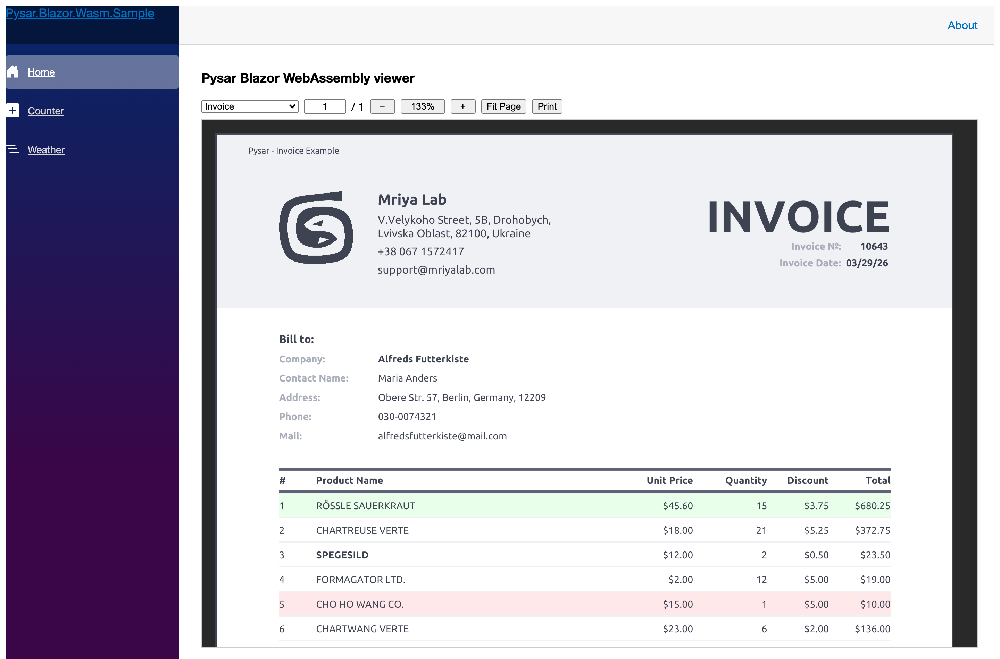
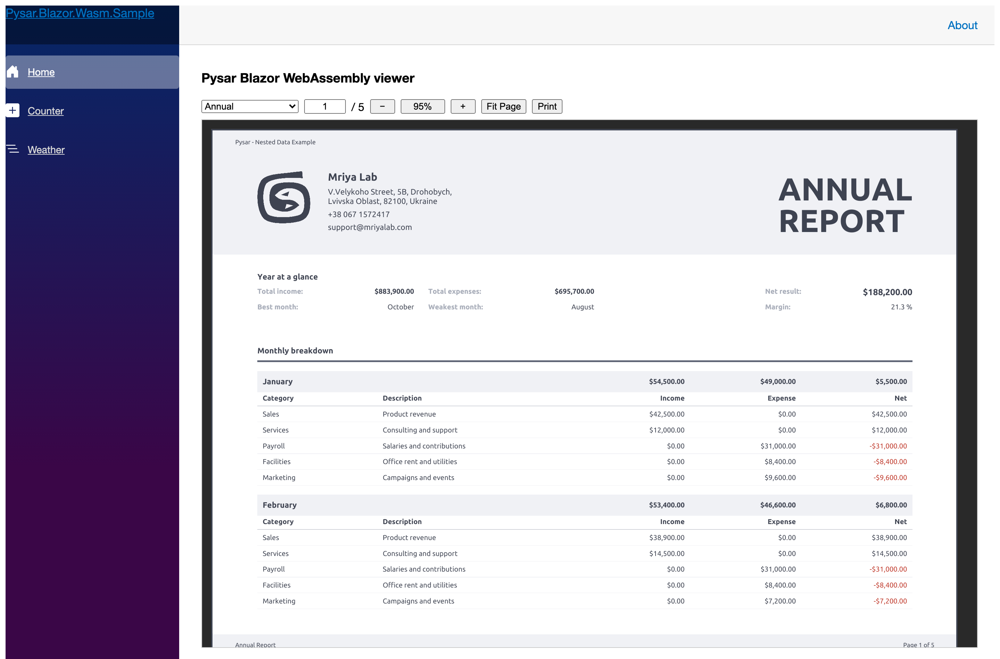

# Pysar.Sample.Shared

The report library the four UI samples share. Nothing here knows about Avalonia, WPF, MAUI or the
browser — that is the point: reports are authored once and hosted anywhere.

| Report | Shows |
| --- | --- |
| `Reports/Invoice/InvoiceReport.rxaml` | Bands, a reusable component, converters, a custom QR element |
| `AnnualReport.rxaml` | Nested collections and a five-page document |
| `RevenueByCustomerReport.rxaml` | Grouping and totals |





## Reusable components

A `ReportView` with an `x:Class` is a component: its own XAML file, its own resource scope, and
bindable parameters declared in the code-behind. `CompanyHeader` is the document banner shared by
all three reports.

```xml
<ReportView x:Class="Pysar.Sample.Shared.Views.CompanyHeader"
            xmlns="https://mriyalab.com/pysar"
            x:Name="Root"
            Height="115">

    <!-- A component owns its resource scope, so it merges the shared styles itself. -->
    <ReportView.Resources>
        <ResourceDictionary>
            <ResourceDictionary.MergedDictionaries>
                <ResourceDictionary Source="../Styles/ReportStyles.rxaml" />
            </ResourceDictionary.MergedDictionaries>
        </ResourceDictionary>
    </ReportView.Resources>

    <Grid Padding="50,20" ColumnDefinitions="Auto, 170, *, 200" ColumnSpacing="20">
        <Image Grid.Column="0" Width="60" Height="60"
               Source="{Binding LogoSource, Source={x:Reference Root}}" />
        <!-- ... -->
    </Grid>
</ReportView>
```

`Source={x:Reference Root}` is what makes a parameter a parameter: the binding resolves against the
component instance instead of the row the surrounding band is on.

The parameters themselves are `BindableProperty` declarations, and one of them fans out into the
rest, so a caller can pass a whole `Organization` instead of five strings:

```csharp
public static BindableProperty CompanyProperty { get; } =
    BindableProperty.Create(nameof(Company), typeof(Organization), typeof(CompanyHeader),
        null, propertyChanged: OnCompanyPropertyChanged);

private static void OnCompanyPropertyChanged(BindableObject control, object? oldValue, object? newValue)
{
    if (control is CompanyHeader header && newValue is Organization organization)
    {
        header.CompanyName = organization.Company;
        header.CompanyAddress = organization.Address;
        header.LogoSource = new FileImageSource(organization.Logo);
        // ...
    }
}
```

Used from a report:

```xml
<views:CompanyHeader Company="{Binding Company}"
                     DocumentDate="{Binding Date}"
                     DocumentDateLabel="Invoice Date:"
                     DocumentNumber="{Binding Number}"
                     DocumentNumberLabel="Invoice №:"
                     DocumentTitle="{Binding Metadata.Title,
                                             Source={x:Reference Root},
                                             Converter={StaticResource Upper}}" />
```

## Shared styles and design-time data

`Styles/ReportColors.rxaml` and `Styles/ReportStyles.rxaml` are merged by every report, so the whole
document set is themed from one place. `d:DataContext` gives the IDE previewer a live instance:

```xml
<Report x:Class="Pysar.Sample.Shared.Reports.Invoice.InvoiceReport"
        xmlns="https://mriyalab.com/pysar"
        xmlns:d="http://schemas.microsoft.com/expression/blend/2008"
        d:DataContext="{d:DesignInstance Type=reports:InvoiceData, IsDesignTimeCreatable=True}">

    <Report.Resources>
        <ResourceDictionary>
            <ResourceDictionary.MergedDictionaries>
                <ResourceDictionary Source="../../Styles/ReportStyles.rxaml" />
            </ResourceDictionary.MergedDictionaries>

            <conv:UppercaseConverter x:Key="Upper" />
        </ResourceDictionary>
    </Report.Resources>

    <Metadata Title="Invoice" Author="Andrii Kolodiichyk" />
```

The same `CreateDesignInstance()` factories back the pickers in the UI samples, which is why every
host shows real-looking data with no data layer behind it.

## Host-agnostic bootstrap

The one thing a report library cannot do for itself is know where its fonts and images come from.
`ReportBootstrap` splits that into a full initialiser for disk-based hosts and two registration
methods that any host can call:

```csharp
public sealed class ReportBootstrap : IReportBootstrap
{
    /// <summary>Console-style hosts: install a disk-reading file system, then register everything.</summary>
    public static void Initialize(SkiaReportRenderer renderer)
    {
        ReportPlatformHandler.Create(new FileSystemPlatformHandler());

        RegisterFonts(ReportPlatformHandler.FontCollection);
        RegisterDrawers(renderer);
    }

    public static void RegisterFonts(IFontCollection fonts)
    {
        fonts.AddFont("Fonts/Ubuntu-Bold.ttf", "Ubuntu", FontStyle.Bold);
        fonts.AddFont("Fonts/Ubuntu-Regular.ttf", "Ubuntu");
        fonts.AddFont("Fonts/LibreBarcode128-Regular.ttf", "LibreBarcode128");
        // ...
    }

    public static void RegisterDrawers(SkiaReportRenderer renderer)
        => renderer.WithDrawer<QRCode>(new QRCodeDrawer());
}
```

Hosts that ship assets inside an application package — MAUI, and Blazor over HTTP — install their
own platform handler and call `RegisterFonts` directly.

Implementing `IReportBootstrap` is also what lets the design-time `.rxaml` previewer find these
registrations by reflection; without it, custom fonts and images silently vanish from the preview.
